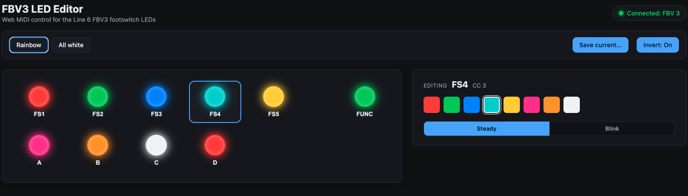

# FBV3 over USB: footswitch LED control

Light up the footswitch **LEDs** on a **Line 6 FBV3 (MK3)** from your computer over USB.
Any color, any switch, no Line 6 amp required. Comes with a click-and-pick web editor and a
one-time firmware update for the pedal.



## 👉 Just want to light up your pedal?

**Follow the [Step-by-Step Guide](GUIDE.md).** Plain language, no coding, no terminal. It
walks you through the one-time firmware update, then the live editor at
**[gonzodamus.github.io/FBV3_over_USB](https://gonzodamus.github.io/FBV3_over_USB/)**
(Chrome or Edge). The editor needs the patched firmware first; without it, the page just
shows "Pedal not found."

If you're not a developer, the guide is all you need. The rest of this README is the
technical overview: the MIDI protocol, the command line, and how the patch works.

## How it works

The patch is built on Line 6 firmware v1.02.00 and boots as **FBV Chroma 1.1** (it shows
that on the pedal's LCD, and lists as version 1.10 in the Line 6 Updater).

Stock firmware already sends MIDI **out** (knobs, expression pedal, switches) but ignores
almost all inbound USB MIDI, so the LEDs stay dark without a host amp. This patch reuses the
dropped inbound Control Change messages and routes them to the firmware's existing LED
routine. The image is patched in place at the same size, so the device's boot integrity check
still passes.

It also adds a switchable footswitch-LED behavior, toggled over USB (CC #16):

- **Inverted** (default): the LED is lit in its USB-set color when the switch is *not*
  pressed, and goes dark *while* it's held.
- **Stock**: the LED is off at rest and lights in its USB-set color only *while* pressed.

## Tradeoffs

The only thing this patch gives up is the **factory manufacturing self-test** (the "NITEST"
button and LCD self-test). Our LED code is tucked inside that routine, so it no longer runs.
It's an assembly-line diagnostic with no documented way for a player to trigger it, so in
normal use you won't notice it's gone. Everything else (MIDI out, the firmware updater, the
LEDs themselves) keeps working, and reverting is just reflashing the stock firmware.

## Requirements

- Line 6 **FBV3 (MK3)**, connected by USB.
- The **Line 6 FBV3 Updater** (or your usual method) to flash a `.hxf` file.
- For the command-line usage below: [`sendmidi`](https://github.com/gbevin/SendMIDI)
  (`brew install sendmidi` on macOS; `receivemidi` to read replies). Prefer not to use the
  terminal? Use the **[web editor](https://gonzodamus.github.io/FBV3_over_USB/)** instead.

## Installation (flash the firmware)

1. In the Line 6 Updater, choose **update from a file** and select
   **`firmware/Fbv3_Chroma_1.1.hxf`**.
2. The Updater may show a one-time error and restart partway through. Let it retry. (Our zlib
   stream isn't byte-identical to Line 6's, but the device verifies the *decompressed* image,
   which is correct, so it boots.)
3. After it reboots, the pedal shows up as the MIDI device **`FBV 3`**.

> Don't have the patched file yet? Build it yourself, see
> [Building from source](#building-from-source).

## Usage

```
sendmidi dev "FBV 3" cc <LED> <value>
```

**LED index** (the CC number):

| idx | LED   | idx | LED      | idx | LED  |
|----:|-------|----:|----------|----:|------|
| 0-4 | FS1-FS5 | 5-8 | ToneA-ToneD | 9 | Pedal Volume |
| 10  | Pedal Wah | 11 | Tap Tempo | 12 | FUNC |
| 13  | Diagnostic |   |          |     |      |

**Value** = `state x 8 + color`:

- `state`: `0` = off, `1` = steady (values **8-15**), `2`+ = blink (values **16+**)
- `color` (low 3 bits): `0` red, `1` green, `2` blue, `3` cyan, `4` yellow, `5` pink, `6` orange, `7` white

So a **steady color** is `8 + color`:

| value | color  | value | color  |
|------:|--------|------:|--------|
| 8     | red    | 12    | yellow |
| 9     | green  | 13    | pink   |
| 10    | blue   | 14    | orange |
| 11    | cyan   | 15    | white  |

**Examples:**

```sh
sendmidi dev "FBV 3" cc 0 9      # FS1  -> steady green
sendmidi dev "FBV 3" cc 12 15    # FUNC -> steady white
sendmidi dev "FBV 3" cc 2 18     # FS3  -> blinking blue   (16 + 2)
sendmidi dev "FBV 3" cc 3 0      # FS4  -> off
```

### Footswitch LED mode (CC #16)

CC number **16** is reserved as a global toggle for how footswitch LEDs react to presses (the
LED *color* always comes from the per-LED CCs above):

```sh
sendmidi dev "FBV 3" cc 16 0     # inverted (default): lit at rest, dark while pressed
sendmidi dev "FBV 3" cc 16 1     # stock: off at rest, lit only while pressed
```

The mode is a RAM flag, so it **resets to inverted on power-up**. Resend `cc 16 1` on connect
if you want stock mode. (LED index 16 isn't a real control; it's just the command channel for
this flag.)

## Verify the build

The patched firmware answers a standard MIDI Identity Request and reports its version. With
`receivemidi` (or any MIDI monitor) listening to `FBV 3`:

```sh
sendmidi dev "FBV 3" syx hex 7E 7F 06 01     # identity request
# reply carries the "FBV Chroma 1.1" version marker  <- the modded-build identifier
```

## Building from source

The patched `.hxf` is reproducible from the stock firmware. Put your own copy of
`Fbv3_v1_02_00.hxf` in `firmware/` first, then:

```sh
python3 build/build_firmware.py            # writes firmware/Fbv3_Chroma_1.1.hxf
pip install capstone                        # optional: also disassemble-verifies the patch
```

Prefer not to use the terminal? Double-click **`Build Firmware.command`** (Mac) or
**`Build Firmware (Windows).bat`** (Windows). Both run the same build and tell you where
the output landed.

`build/build_firmware.py` documents exactly what it changes: a 4-byte detour, a 0x48-byte
CC handler placed in dead space inside the factory self-test routine, a 0x1a-byte mode
stub, a redirect of the switch-event LED call, and the version/banner string edits.

## Recovery

Flashing is reversible. If a build misbehaves, restore the stock firmware:

1. Hold **FS1 + A** while plugging in USB. The LCD shows **Update Mode**.
2. Flash **`firmware/Fbv3_v1_02_00.hxf`** with the Line 6 Updater.

The recovery bootloader lives in a separate flash region that this patch never touches.

## License

The original work in this repo (the build script, the web app, the helper, and the docs) is
**MIT licensed**, see [LICENSE](LICENSE). The Line 6 firmware is **not**: it's Line 6 /
Yamaha Guitar Group's copyrighted property and isn't covered by the MIT license or
distributed here.

## Notes

- The firmware images are Line 6's copyrighted property (the patched one is a derivative).
  They're for **personal use**, so please don't redistribute them. They're gitignored here
  for that reason, and the build script regenerates the patched image from your own copy of
  the stock firmware.
- This is an **unofficial** modification, not affiliated with or endorsed by Line 6 / Yamaha
  Guitar Group. Use at your own risk, with no warranty.
