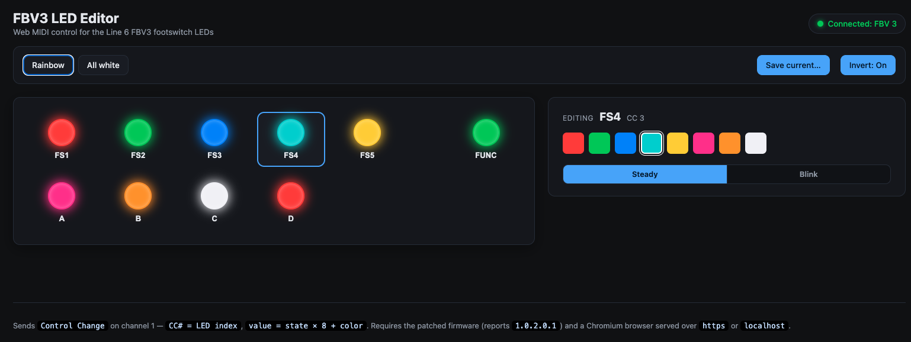

# FBV3 over USB: footswitch LED control

Light up the footswitch **LEDs** on a **Line 6 FBV3 (MK3)** from your computer over USB.
Any color, any switch, no Line 6 amp required. Comes with a click-and-pick web editor and a
one-time firmware update for the pedal.



> ### 👉 Just want to light up your pedal?
> **Follow the [Step-by-Step Guide](GUIDE.md).** Plain language, no coding, no terminal.
> It walks you through the one-time firmware update, then the live editor:
> **https://gonzodamus.github.io/FBV3_over_USB/** (Chrome or Edge).
>
> The editor only works once your pedal has the patched firmware. Without it, the page
> opens but stays on "Pedal not found."

**Status:** working on Line 6 firmware v1.02.00. The patched build reports version
`1.0.2.0.1`. The rest of this README is the technical overview (command line plus how it
works). If you're not a developer, the [guide](GUIDE.md) above is all you need.

**Status:** working on Line 6 firmware v1.02.00. The patched build is **FBV Chroma 1.1**:
the pedal's LCD shows "FBV Chroma 1.1" at startup, and it lists as version 1.10 in the
Line 6 Updater. The rest of this README is the **technical** overview (command line + how it
works) — if you're not a developer, the [guide](GUIDE.md) above is all you need.

The only thing this patch gives up is the **factory manufacturing self-test** (the "NITEST"
button and LCD self-test). Our LED code is tucked inside that routine, so it no longer runs.
It's an assembly-line diagnostic with no documented way for a player to trigger it, so in
normal use you won't notice it's gone. Everything else (MIDI out, the firmware updater, the
LEDs themselves) keeps working, and reverting is just reflashing the stock firmware.

## How it works

Stock firmware already sends MIDI **out** (knobs, expression pedal, switches) but ignores
almost all inbound USB MIDI, so the LEDs stay dark without a host amp. This patch reuses the
dropped inbound Control Change messages and routes them to the firmware's existing LED
routine. The image is patched in place at the same size, so the device's boot integrity check
still passes.

It also adds a switchable footswitch-LED behavior, toggled over USB (CC #16):

- **Inverted** (default): the LED is lit in its USB-set color when the switch is *not*
  pressed, and goes dark *while* it's held.
- **Stock**: the LED is off at rest and lights in its USB-set color only *while* pressed.

## Requirements

- Line 6 **FBV3 (MK3)**, connected by USB.
- The **Line 6 FBV3 Updater** (or your usual method) to flash a `.hxf` file.
- For the command-line usage below: [`sendmidi`](https://github.com/gbevin/SendMIDI)
  (`brew install sendmidi` on macOS; `receivemidi` to read replies). Prefer not to use the
  terminal? Use the **[web editor](https://gonzodamus.github.io/FBV3_over_USB/)** instead.

## Installation (flash the firmware)

1. Flash **`firmware/Fbv3_ledcc_v7.hxf`** with the Line 6 Updater, the same way you'd apply
   an official update.
2. The Updater may show a one-time error and restart partway through. Let it retry. (Our zlib
   stream isn't byte-identical to Line 6's, but the device verifies the *decompressed* image,
   which is correct, so it boots.)
3. After it reboots, the pedal shows up as the MIDI device **`FBV 3`**.

> Don't have the patched file yet? Build it yourself, see
> [Building from source](#building-from-source).

> ⚠️ **Use the Updater's *offline* mode.** In online mode the Line 6 Updater
> detects your connected FBV3, checks it against Line 6's servers, and pushes the
> latest *official* firmware — overwriting your custom build to "correct" anything
> that doesn't match the official release. Offline mode lets you point the updater
> at a local `.hxf` file directly and skips that server check; that's the standard
> way to install any custom/modified firmware on Line 6 devices. A few things to
> keep in mind:
>
> - **Don't let the Updater launch in online mode with the FBV3 connected** — it
>   may start flashing before you can intervene.
> - **Keep a backup of the stock firmware file** before installing, so you can
>   restore to factory if needed (see [Recovery](#recovery)).
> - After flashing FBV Chroma, **avoid running the Updater in online mode with the
>   unit connected** going forward, or it'll likely flag the firmware as outdated
>   and try to overwrite it.

## Usage

```
sendmidi dev "FBV 3" cc <LED> <value>
```

**LED index** (the CC number):

| idx | LED   | idx | LED      | idx | LED  |
|----:|-------|----:|----------|----:|------|
| 0-4 | FS1-FS5 | 5-8 | ToneA-ToneD | 9 | Pedal Volume |
| 10  | Pedal Wah | 11 | Tap Tempo | 12 | FUNC |
| 13  | Diagnostic |   |          |     |      |

**Value** = `state x 8 + color`:

- `state`: `0` = off, `1` = steady (values **8-15**), `2`+ = blink (values **16+**)
- `color` (low 3 bits): `0` red, `1` green, `2` blue, `3` cyan, `4` yellow, `5` pink, `6` orange, `7` white

So a **steady color** is `8 + color`:

| value | color  | value | color  |
|------:|--------|------:|--------|
| 8     | red    | 12    | yellow |
| 9     | green  | 13    | pink   |
| 10    | blue   | 14    | orange |
| 11    | cyan   | 15    | white  |

**Examples:**

```sh
sendmidi dev "FBV 3" cc 0 9      # FS1  -> steady green
sendmidi dev "FBV 3" cc 12 15    # FUNC -> steady white
sendmidi dev "FBV 3" cc 2 18     # FS3  -> blinking blue   (16 + 2)
sendmidi dev "FBV 3" cc 3 0      # FS4  -> off
```

### Footswitch LED mode (CC #16)

CC number **16** is reserved as a global toggle for how footswitch LEDs react to presses (the
LED *color* always comes from the per-LED CCs above):

```sh
sendmidi dev "FBV 3" cc 16 0     # inverted (default): lit at rest, dark while pressed
sendmidi dev "FBV 3" cc 16 1     # stock: off at rest, lit only while pressed
```

The mode is a RAM flag, so it **resets to inverted on power-up**. Resend `cc 16 1` on connect
if you want stock mode. (LED index 16 isn't a real control; it's just the command channel for
this flag.)

## Verify the build

The patched firmware answers a standard MIDI Identity Request and reports its version. With
`receivemidi` (or any MIDI monitor) listening to `FBV 3`:

```sh
sendmidi dev "FBV 3" syx hex 7E 7F 06 01     # identity request
# reply carries the "FBV Chroma 1.1" version marker  <- the modded-build identifier
```

## Building from source

The patched `.hxf` is reproducible from the stock firmware. Put your own copy of
`Fbv3_v1_02_00.hxf` in `firmware/` first, then:

```sh
python3 build/build_firmware.py            # writes firmware/Fbv3_ledcc_v7.hxf
pip install capstone                        # optional: also disassemble-verifies the patch
```

On a Mac you can skip the terminal: double-click **`Build patched firmware (Mac).command`**
in Finder — it runs the same build and tells you where the output landed.

`build/build_firmware.py` documents exactly what it changes (a 4-byte detour, a 0x48-byte
CC handler placed in dead space inside the factory self-test routine, a 0x1a-byte mode
stub, a redirect of the switch-event LED call, and a 1-byte version bump). The
reverse-engineering notes are in [`docs/FBV_LED_FINDINGS.md`](docs/FBV_LED_FINDINGS.md).

## What this patch changes (and what it costs)

Every edit is made in place, so the firmware image stays the same size and the device's
boot integrity check still passes (105 bytes changed total).

**Kept — nothing player-facing is lost:**
- MIDI **out** from the knobs, expression pedal, and footswitches.
- Inbound USB **SysEx** handling (device identity / firmware updater), left intact.

**Added / changed behavior:**
- USB Control Change → footswitch LED color/state (the main feature).
- **Switchable footswitch-LED behavior** via CC #16: *inverted* (default — lit at rest,
  dark while pressed) or *stock* (off at rest, lit only while pressed). Either way the LED
  *color* you set over USB persists. The mode flag lives in RAM and resets to inverted on
  power-up.

**Removed:**
- The **factory manufacturing self-test** (the "NITEST" button/LCD self-test routine).
  The CC handler and mode stub are tucked inside that routine's code, so the self-test
  no longer functions. It's an assembly-line diagnostic with no documented end-user way
  to trigger it, so in normal use you don't lose anything you can reach.

**Changed:**
- Version marker bumped so the build identifies as **FBV Chroma 1.1** (shown on the
  pedal's LCD at startup, and listed as version 1.10 in the Line 6 Updater).

`build/build_firmware.py` documents exactly what it changes (a 4-byte detour, a 0x48-byte CC
handler placed in dead space inside the factory self-test routine, a 0x1a-byte mode stub, a
redirect of the switch-event LED call, and a 1-byte version bump). The reverse-engineering
notes are in [`docs/FBV_LED_FINDINGS.md`](docs/FBV_LED_FINDINGS.md).

## Recovery

Flashing is reversible. If a build misbehaves, restore the stock firmware:

1. Hold **FS1 + A** while plugging in USB. The LCD shows **Update Mode**.
2. Flash **`firmware/Fbv3_v1_02_00.hxf`** with the Line 6 Updater.

The recovery bootloader lives in a separate flash region that this patch never touches.

## License

The original work in this repo (the build script, the web app, the helper, and the docs) is
**MIT licensed**, see [LICENSE](LICENSE). The Line 6 firmware is **not**: it's Line 6 /
Yamaha Guitar Group's copyrighted property and isn't covered by the MIT license or
distributed here.

## Notes

- The firmware images are Line 6's copyrighted property (the patched one is a derivative).
  They're for **personal use**, so please don't redistribute them. They're gitignored here
  for that reason, and the build script regenerates the patched image from your own copy of
  the stock firmware.
- This is an **unofficial** modification, not affiliated with or endorsed by Line 6 / Yamaha
  Guitar Group. Use at your own risk, with no warranty.
